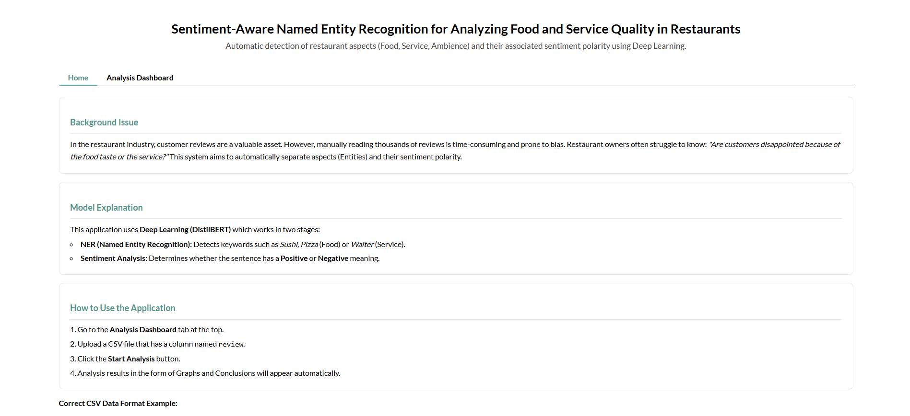

# Sentiment-Aware Named Entity Recognition for Restaurant Reviews

This project is a **Deep Learning-based application** designed to analyze restaurant reviews by combining **Sentiment Analysis (SA)** and **Named Entity Recognition (NER)**. The system helps identify what customers are talking about (such as food or service) and how they feel about those aspects.

The application is built using **DistilBERT** models and deployed through an interactive **Gradio** interface.

---

## Project Overview

Restaurant reviews often contain valuable feedback, but reading them one by one is time-consuming and subjective. This project aims to automatically:

* Detect important restaurant-related entities (e.g., food items, services)
* Identify whether the sentiment expressed is positive or negative
* Present insights through simple visualizations and summaries

The result is a dashboard that makes it easier to understand customer opinions at a glance.

---

## Application Interface

The application consists of two main pages:

### Home Page

The Home page provides a brief explanation of the problem, the models used, and how to use the application.



### Analysis Dashboard

The Analysis Dashboard is where users interact with the system and view results.


---

## Features

### 1. Input Data

* Upload restaurant reviews in CSV format
* The CSV file must contain a column named `review`

### 2. Use Sample Data

* Quickly test the application using a provided `sample_reviews.csv`
* Useful for understanding model behavior before using custom data

### 3. Conclusion

* Automatically generated summary of overall customer sentiment
* Highlights whether feedback is mostly positive, negative, or mixed

### 4. Data Visualization

#### a. Sentiment Distribution

* Pie chart showing the percentage of positive vs negative reviews

#### b. Top 10 Menu / Services

* Bar chart displaying the most frequently mentioned entities in reviews

### 5. Extraction Details

* Detailed table containing:

  * Review text
  * Text segment
  * Detected entity
  * Associated sentiment

---

## Models Used

* **Sentiment Analysis Model**: DistilBERT for binary classification (Positive / Negative)
* **NER Model**: DistilBERT for token classification using BIO tagging

Both models are fine-tuned on restaurant-related datasets and loaded automatically when the application runs.

---

## Project Structure

```text
DEEP_LEARNING_FINAL_PROJECT/
├── app/
│   └── main_app.ipynb          # Gradio application notebook
├── dataset/
│   ├── ner/                    # NER datasets
│   └── sa/                     # Sentiment Analysis datasets
├── trained_models/
│   ├── ner/                    # Trained NER model
│   └── sa/                     # Trained SA model
├── src/
│   ├── evaluation/
│   ├── NER_Model.ipynb         # NER training notebook
│   └── Sentiment_Model.ipynb   # SA training notebook
├── report/                     # Project report
└── README.md
```


---

## Getting Started (Running the Project Locally)

Follow the steps below to run this project on your local machine.

### 1. Clone the Repository

Open a terminal (Command Prompt, PowerShell, or Terminal) and clone the repository from GitHub:

```bash
git clone <repository-url>
```

Wait until the cloning process finishes. This will create a local copy of the project on your device.

Next, navigate into the project directory:

```bash
cd DEEP_LEARNING_FINAL_PROJECT
```

Make sure you are inside the main project folder before proceeding. You should see folders such as `app/`, `dataset/`, `trained_models/`, and `src/`.

---

### 2. (Optional but Recommended) Create a Virtual Environment

To avoid dependency conflicts, it is recommended to use a virtual environment.

Create a virtual environment:

```bash
python -m venv venv
```

Activate the virtual environment:

* **Windows**

```bash
venv\Scripts\activate
```

* **macOS / Linux**

```bash
source venv/bin/activate
```

Once activated, your terminal should indicate that the virtual environment is in use.

---

### 3. Install Dependencies

Install all required Python packages using the provided `requirements.txt` file:

```bash
pip install -r requirements.txt
```

Make sure the installation completes without errors before continuing.

---

### 4. Prepare the Models

You have two options to prepare the models:

**Option A: Use Pretrained Models (Recommended)**
Ensure that the pretrained models are available in the following directory:

```text
trained_models/
├── ner/
└── sa/
```

**Option B: Retrain the Models**
If you want to retrain the models, run the following notebooks in order:

* `src/NER_Model.ipynb`
* `src/Sentiment_Model.ipynb`

After training, the models will be saved automatically in the `trained_models/` directory.

---

### 5. Run the Application

After the models are ready, navigate to the `app/` folder and open the application notebook:

```text
app/main_app.ipynb
```

Run **Run All Cells** in the notebook.

Once all cells have finished executing, a Gradio interface URL will appear in the notebook output.

---

### 6. Use the Application

1. Open the Gradio URL shown in the notebook output
2. Use the navigation menu to switch between **Home** and **Analysis Dashboard**
3. Upload a CSV file containing restaurant reviews or use the provided sample data
4. Explore sentiment results, extracted entities, and visualizations

---

## Project Reflection

This project helped us understand how Sentiment Analysis and Named Entity Recognition can work together to analyze restaurant reviews more effectively. Beyond predicting sentiment, the model identifies key aspects such as food and services. We also learned the importance of proper data preparation, model evaluation, and clear result presentation. Using a Gradio interface made the analysis easier to understand and more practical, while strengthening our understanding of end-to-end NLP workflows in real-world applications.

---

## Team Members

- Rainer Yesaya Villareal / 2702275730
- William Hartanto / 2702274532